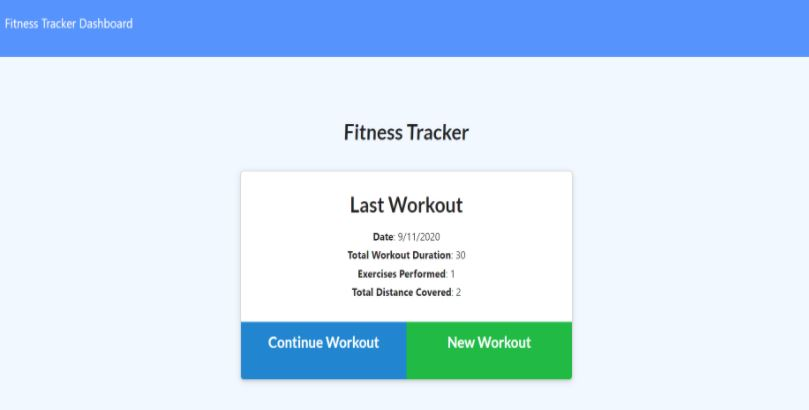

<h1 align="center">Workout Tracker</h1>

<!-- PROJECT BADGES -->

* Deployed at https://immense-ridge-32351.herokuapp.com/

   

* Click 'New Workout' to add a new workout today, which can include several exercises; click 'Add Exercise' if you are continuing the workout after this one or 'Complete' if this is the last one.  If later in the day you want to add another exercise to the same workout, click 'Continue Workout' from the homepage (rather than 'New Workout').  To see the last seven days of workouts, click the top left 'Dashboard'.  'Fitness Tracker' on the top left will take you back to the homepage.   

# Table of Contents
* [Description](#Description)
* [Technologies](#Technologies)
* [Installation](#Installation)
* [Usage](#Usage)
* [Contributors](#Contributors)
* [Tests](#Tests)
* [Github](#Github)
* [Email](#Email)

## Description
Created a Workout App to keep track of daily exercise 

## Technologies
Express server, Mongoose database, Morgan for logging, Heroku for deployment

## Installation
npm i, 
npm run seed

## Usage
node server.js

## Contributors
Margaret Seiche

## Tests
none

## Github Profile
margaretseiche

## Questions? Email to     
seichemargaret@gmail.com
